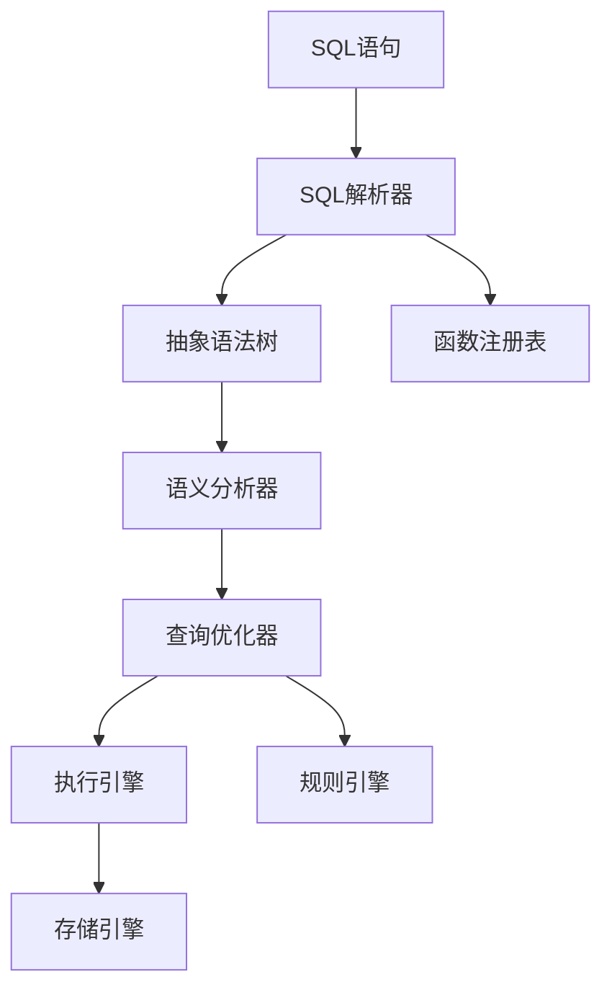
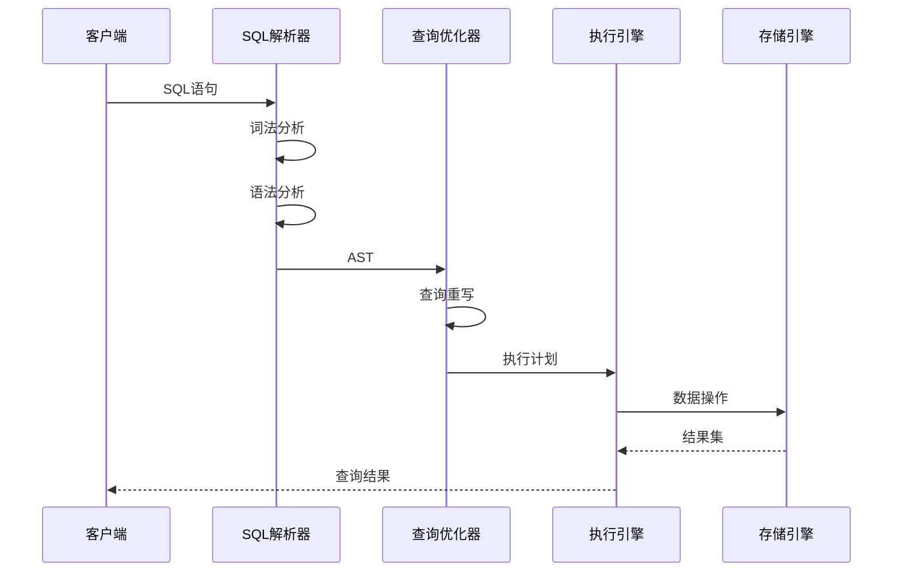

# SQL扩展模块功能需求文档

## 文档信息

| 日期 | 版本 | 作者 | 说明 |
|------|------|------|------|
| 2024-03-21 | 1.0 | 需求分析组 |  |
| | | |  |
| | | |  |
| | | |  |

## 一、需求介绍

### 1.1 背景说明

标准SQL语言在处理复杂业务逻辑和数据分析时存在一定局限性，需要扩展SQL功能来满足更复杂的业务需求。同时，随着数据处理需求的增加，需要对SQL查询进行优化以提高性能。

### 1.2 需求价值

SQL扩展模块能够提供更丰富的SQL功能，包括自定义函数、存储过程、查询优化等，提高开发效率和查询性能，满足复杂的业务需求。

## 二、功能需求

### 2.1 功能列表

#### 2.1.1 SQL语法扩展：支持自定义函数、操作符、数据类型等
#### 2.1.2 查询优化：提供查询重写、执行计划优化等功能
#### 2.1.3 存储过程支持：支持存储过程的创建和执行
#### 2.1.4 SQL解析：提供SQL语句的词法分析和语法分析
#### 2.1.5 优化建议：分析SQL查询并提供优化建议
#### 2.1.6 兼容性支持：支持多种SQL方言的兼容

### 2.2 功能详细描述

#### 2.2.1 核心功能
- **功能优先级**：高
- **实现复杂度**：中等
- **性能要求**：高性能、低延迟
- **可靠性要求**：99.9%可用性

#### 2.2.2 扩展功能
- **功能优先级**：中
- **实现复杂度**：中等
- **兼容性要求**：向后兼容
- **可维护性要求**：模块化设计

## 三、非功能需求

### 3.1 功能依赖

#### 3.1.1 系统依赖
- 操作系统：Linux/Windows/macOS
- 编译器：GCC 或 Clang
- 标准库：C++17 标准库

#### 3.1.2 第三方依赖
- 日志库：可选集成 spdlog、log4cxx
- 网络库：可选集成 boost::asio
- 序列化库：可选集成 protobuf、json

### 3.2 资源需求

#### 3.2.1 硬件资源
- **CPU**：最低2核，推荐4核以上
- **内存**：最低4GB，推荐8GB以上
- **存储**：最低10GB可用空间
- **网络**：千兆网络接口

#### 3.2.2 软件资源
- **操作系统**：Linux, Windows, macOS
- **运行时环境**：C++17 标准库
- **开发工具**：CMake, Git

### 3.3 性能需求

#### 3.3.1 响应时间
- **平均响应时间**：< 10ms
- **95%响应时间**：< 50ms
- **99%响应时间**：< 100ms
- **超时时间**：< 5000ms

#### 3.3.2 吞吐量
- **并发用户数**：支持1000+并发
- **事务处理量**：> 10000 TPS
- **数据处理量**：> 100MB/s
- **查询处理量**：> 50000 QPS

### 3.4 可用性需求

#### 3.4.1 系统可用性
- **可用性指标**：99.9%
- **平均故障时间**：< 4小时/月
- **恢复时间目标**：< 30分钟
- **故障检测时间**：< 5分钟

#### 3.4.2 容错能力
- **故障自动恢复**：支持
- **数据备份**：自动备份
- **负载均衡**：动态负载均衡
- **降级处理**：优雅降级

### 3.5 安全性需求

#### 3.5.1 数据安全
- **数据加密**：支持AES-256加密
- **传输安全**：支持TLS 1.3
- **访问控制**：基于角色的访问控制
- **审计日志**：完整的操作审计

#### 3.5.2 系统安全
- **身份认证**：多因子认证
- **权限管理**：细粒度权限控制
- **安全扫描**：定期安全漏洞扫描
- **入侵检测**：实时入侵检测

### 3.6 可扩展性需求

#### 3.6.1 水平扩展
- **节点扩展**：支持动态添加节点
- **负载分布**：自动负载重分布
- **数据分片**：支持数据自动分片
- **服务发现**：自动服务注册发现

#### 3.6.2 垂直扩展
- **资源扩展**：支持CPU、内存动态扩展
- **存储扩展**：支持存储容量动态扩展
- **功能扩展**：插件化架构支持
- **协议扩展**：支持多种通信协议

## 四、验收标准

## 五、功能设计

### 5.1 总体架构
- 描述sql_extend模块的总体架构图（可插入 Mermaid 或图片）。
- 列出主要组件及其交互。
-
- **示例架构图**：

### 5.2 组件划分
| 组件 | 职责 | 关键接口 |
|------|------|----------|
| SQLParser | SQL解析器 | `parse()` / `validate()` / `buildAST()` |
| Optimizer | 查询优化器 | `optimize()` / `rewrite()` / `suggest()` |
| FunctionRegistry | 函数注册表 | `register()` / `lookup()` / `invoke()` |
| RuleEngine | 规则引擎 | `applyRules()` / `addRule()` / `evaluate()` |

### 5.3 数据模型
- 列出关键数据结构及说明。
- 使用UML类图或Mermaid表示。

### 5.4 交互流程
- 典型业务流程时序图：

